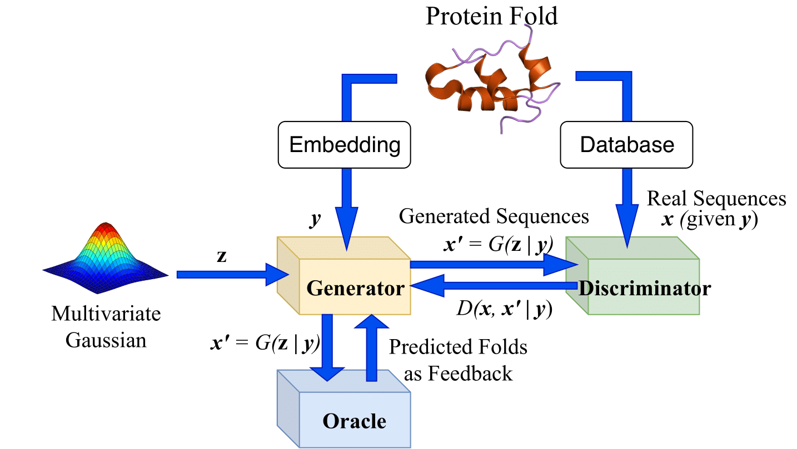

# gcWGAN

## Traning Process


## Pre-requisite
* Build the environment ***DeepDesign_acc*** following the instruction in the ***Environments*** folder.

## Table of contents:
* **WarmStart:** Contain the codes for the semi-supervised learning process (training with the unlabeled data from Uniref and the labeled data from SCOPe).
* **DeepSF_model_weignt:** Contain the weights for DeepSF.
* **Hyper-parameter_Tuning:** Contain the scripts for tuning the weight of the feedback penalty.
* **language_helpers:** Contain the functions to help load the training data. Need to be imported for related codes.
* **DataLoading.py:** Contain the functions to help load and process the data. Need to be imported for related codes.

## Operations:
* **Load and Set Environment**
```
module load Anaconda/2-5.0.1
source activate DeepDesign_acc
module load cuDNN/5.1-CUDA-8.0.44
```
Open the file ***~/.keras/keras.json***, and set "backend" to be "tensorflow", which makes the file looks like:
```
{
    "epsilon": 1e-07,
    "floatx": "float32",
    "image_dim_ordering":"tf",
    "image_data_format": "channels_last",
    "backend": "tensorflow"
}
```
* **Warm Start:** Go to the ***WarmStart*** folder. Firstly run 
```
python Pretrain_WGAN.py  
```
Then run
```
python Semi_WGAN.py  
```
* **To train the model:**
```
python gcWGAN_training.py <learning rate>  <critic iteration number>  <noise length>  <feedback penalty weight>
```
* **To train the model without semi-supervised learning:**
```
python gcWGAN_training_withoutSemi.py 
```
* **To estimate the loss:**
On training set:
```
python gcWGAN_loss_calculation.py <check points path>  <results path>
python Loss_plot.py <image path>  <*list of the weights>
```
Notice: \<*list of the weights\> refers to multiple arguments.

On different set (train, vali or test):
```
python gcWGAN_loss_calculation_diffset.py <check points path>  <results path> <set kind>
python Loss_plot_diffset.py <image path>  <*list of the weights>  <set kind>
```

Show the improvement from semi-supervision:
```
python Semi_improvement_plot.py <image path>  <*list of the weights> 
```

